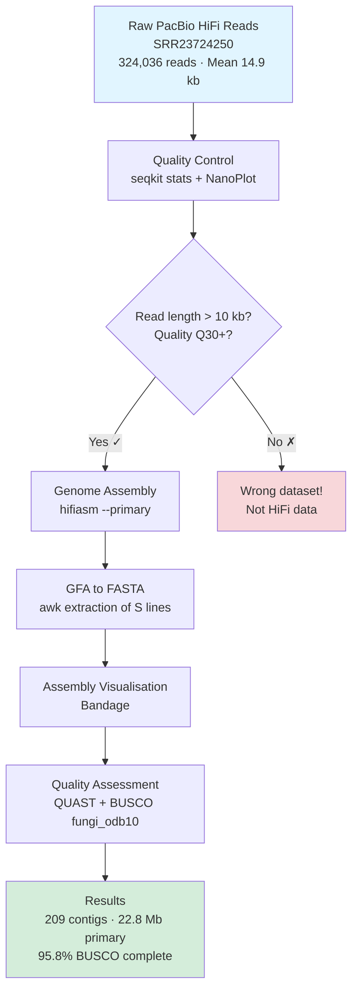
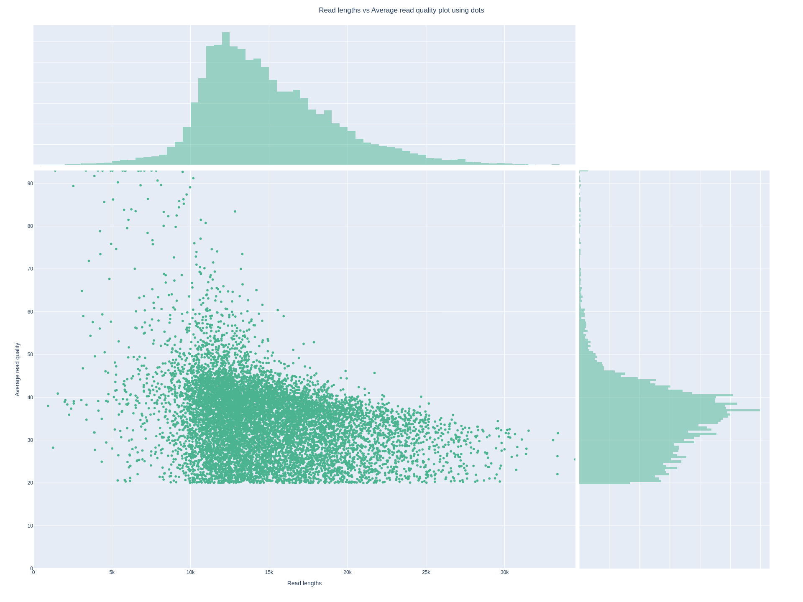
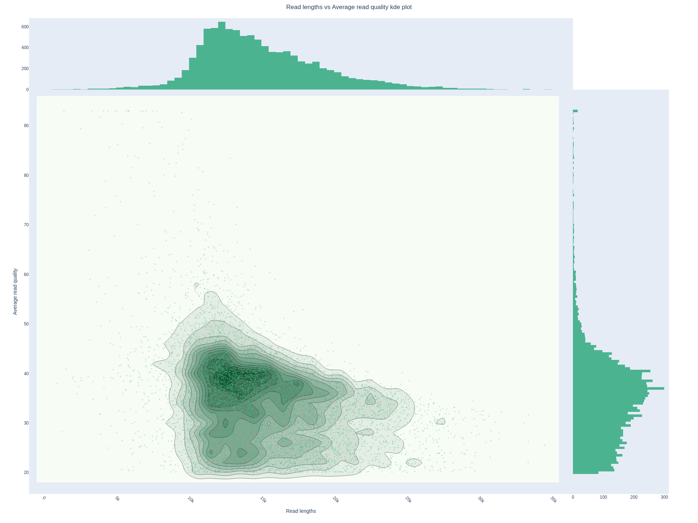

# _Candida albicans_ Diploid Genome Assembly

End-to-end pipeline for fungal diploid genome assembly using PacBio HiFi long-read sequencing. Second pipeline in an assembly benchmark series, extending the approach from [_E. coli_ HiFi assembly](https://github.com/vikos77/ecoli-hifi-assembly) to a diploid organism. This project benchmarks assembly strategies across increasing genomic complexity, with _C. albicans_ representing the step from simple haploid to heterozygous diploid.

_C. albicans_ is an obligate diploid human fungal pathogen with an ~28 Mb haploid genome (~56 Mb diploid), significant heterozygosity, and regions of loss-of-heterozygosity (LOH). All of that makes it a much harder assembly target than _E. coli_.

## Dataset

**Accession:** [SRR23724250](https://www.ncbi.nlm.nih.gov/sra/SRR23724250) (NCBI SRA)
**Organism:** _Candida albicans_ SC5314
**Sequencing platform:** PacBio HiFi (Sequel II)
**Read count:** 324,036 reads
**Mean read length:** 14,904 bp
**Max read length:** 43,883 bp
**Total bases:** ~4.83 Gb
**Estimated coverage:** ~86× diploid / ~172× haploid

## Methods



### Quality Control

Used `seqkit stats` to confirm the data is genuine HiFi (mean read length >10 kb, which rules out Illumina or early Nanopore runs). Ran NanoPlot for read-length and quality-score distributions. HiFi reads should cluster around Q20–Q40 and the length distribution should be unimodal with no short-read contamination.

**seqkit stats summary:**

| Metric | Value |
|--------|-------|
| Reads | 324,036 |
| Total bases | 4,829,675,432 bp |
| Min length | 531 bp |
| Mean length | 14,904 bp |
| Max length | 43,883 bp |

Mean read length of 14.9 kb confirms genuine HiFi data. The minimum of 531 bp represents a small tail of short reads that the assembler will naturally down-weight.

**NanoPlot QC:**


*Read length vs quality score (dot plot). HiFi reads cluster at Q20–Q30 across the full length range, confirming high per-base accuracy. No short-read contamination visible.*


*Read length vs quality score (KDE density plot). The density peak confirms most reads are 10–20 kb at Q20+, consistent with PacBio Sequel II HiFi chemistry.*

### Assembly

Assembled with **hifiasm v0.21.0** using the `--primary` flag. This is the key choice for a diploid organism:

- Without `--primary`: hifiasm attempts full haplotype phasing, producing `hap1` and `hap2` outputs. This works well when you have Hi-C or trio data to phase with.
- With `--primary`: hifiasm produces a primary assembly (one allele per locus, choosing the better-supported one) and an alternate assembly (the other alleles). This is more practical when you don't have phasing data.

hifiasm outputs assembly graphs in **GFA format**, with multiple files at different graph simplification levels. The `awk '/^S/{print ">"$2; print $3}'` one-liner extracts only the sequence lines (S-lines) to produce FASTA.

### Assembly Graph Visualisation

Used **Bandage** to visualise the GFA graphs at each stage of graph simplification. This is where you really see how much more complex a diploid fungal assembly is compared to bacteria.

### Quality Assessment

- **QUAST**: standard assembly statistics (N50, contig count, GC%, gene prediction via Glimmer)
- **BUSCO v5.5.0**: gene completeness against the `fungi_odb10` lineage dataset (758 conserved genes)

## Results

### Assembly Graph Complexity

One of the most informative outputs of hifiasm is the series of assembly graphs at different levels of simplification. Bandage visualises these as coloured graphs where nodes are contigs and edges are overlaps.

| Graph | Nodes | Edges | Total length | What it represents |
|-------|-------|-------|-------------|-------------------|
| r_utg (raw unitigs) | 432 | 303 | 39,991,598 bp | All assembled sequences before graph simplification |
| p_utg (processed unitigs) | 344 | 177 | 38,044,907 bp | After removing spurious overlaps |
| p_ctg (primary contigs) | 209 | 2 | 22,777,304 bp | Final primary haplotype assembly |
| a_ctg (alternate contigs) | 69 | 25 | 13,705,835 bp | Alternate haplotype contigs |

**Compare to _E. coli_:** The bacterial assembly produced a single contig with a simple circular graph. Here the raw unitig graph has 432 nodes and 303 edges. This complexity comes from heterozygous sites where the diploid genome has two slightly different sequences and the assembler creates a bubble in the graph for each one.

**Bandage graphs (left to right: r_utg → p_utg → p_ctg → a_ctg):**


*r_utg.gfa: raw unitig graph, 432 nodes, 303 edges. The tangled regions are heterozygous bubbles where two alleles are both represented.*


*p_utg.gfa: processed unitig graph, 344 nodes, 177 edges. Spurious overlaps removed, the structure is cleaner but heterozygous bubbles remain.*


*p_ctg.gfa: primary contig graph, 209 nodes, 2 edges. One path through each bubble chosen, forming the primary assembly.*


*a_ctg.gfa: alternate contig graph, 69 nodes, 25 edges. The "other side" of heterozygous bubbles; more fragmented because alternate alleles have lower read support.*

### Primary Assembly Statistics (QUAST)

| Metric | Value |
|--------|-------|
| Total contigs | 209 |
| Total length | 22,777,304 bp |
| Largest contig | 3,233,620 bp |
| N50 | 1,247,647 bp |
| N90 | 35,024 bp |
| L50 | 6 |
| L90 | 128 |
| GC content | 35.13% |
| N's per 100 kbp | 0.00 |
| Predicted genes (unique) | 2,974 |

### BUSCO Completeness (fungi_odb10, 758 genes)

| Category | Count | Percentage |
|----------|-------|-----------|
| Complete (total) | 726 | 95.8% |
| &nbsp;&nbsp;Single-copy | 721 | 95.1% |
| &nbsp;&nbsp;Duplicated | 5 | 0.7% |
| Fragmented | 2 | 0.3% |
| Missing | 30 | 3.9% |

95.8% BUSCO completeness is a solid result for a primary assembly of a diploid organism. The small number of duplicated BUSCOs (0.7%) reflects some residual heterozygosity not fully resolved into primary/alternate paths. Missing genes (3.9%) are likely in the 19 contigs shorter than 25 kb or in regions of high heterozygosity that fragmented.

### Comparison: _E. coli_ vs _C. albicans_

| Feature | _E. coli_ K-12 | _C. albicans_ SC5314 |
|---------|---------------|----------------------|
| Ploidy | Haploid | Diploid |
| Genome size | 4.67 Mb | ~28 Mb (haploid) |
| Contigs produced | 1 | 209 |
| N50 | 4,665,559 bp | 1,247,647 bp |
| GC content | 50.77% | 35.13% |
| BUSCO completeness | 100% | 95.8% |
| Assembly graph | Simple circle | Complex bubble graph |
| Key challenge | None (trivial) | Diploid heterozygosity |

## Key Findings

**Diploid heterozygosity creates assembly graph bubbles.** Every heterozygous position where the two alleles differ creates a fork in the assembly graph. The 432-node raw unitig graph vs the 1-node _E. coli_ graph directly quantifies the added complexity of a diploid genome.

**`--primary` is the correct strategy without phasing data.** The primary + alternate approach produces a usable linear assembly from a diploid genome without Hi-C or parental sequencing. The tradeoff is explicit: alternate contigs are more fragmented and the primary assembly represents a mosaic of both haplotypes rather than a true phased sequence.

**GFA graph topology diagnoses assembly fragmentation.** Bandage visualisation of the four assembly stages shows _why_ the assembly fragmented (heterozygous bubbles and tangled regions), rather than just reporting that it did. N50 and contig count alone don't distinguish a well-resolved assembly from an under-phased one.

**BUSCO lineage choice is biological, not arbitrary.** `fungi_odb10` (758 genes, 549 fungal genomes) is the correct lineage for _C. albicans_, not the bacterial set. The 95.8% result is strong for a primary diploid assembly and directly comparable across fungal genome projects.

**Coverage does not determine assembly contiguity.** At ~86× diploid coverage, data quantity is not the bottleneck. Assembly fragmentation is driven by genome biology: heterozygosity, LOH boundaries, and repetitive regions that HiFi-only assembly cannot fully resolve without phasing data.

## Technical Details

**Software versions**

| Tool | Version |
|------|---------|
| hifiasm | 0.21.0 |
| seqkit | 2.12.0 |
| NanoPlot | 1.46.2 |
| QUAST | 5.3.0 |
| BUSCO | 5.5.0 |
| Bandage | latest |

**Installation**

```bash
conda env create -f longread_assembly.yaml
conda activate longread-assembly
```

> **Note:** BUSCO requires numpy 1.x (not 2.x). The `longread_assembly.yaml` file pins `numpy<2` to prevent import errors. If you still get errors, see [TROUBLESHOOTING.md](TROUBLESHOOTING.md).

**Computational requirements**

| Resource | Value |
|----------|-------|
| Platform | Linux (Ubuntu) |
| CPU | 8 threads |
| RAM | ~32 GB |
| Storage | ~15 GB (including raw data) |

## Repository Structure

```
candida-diploid-assembly/
├── README.md
├── longread_assembly.yaml    # conda environment
├── TROUBLESHOOTING.md
├── .gitignore
├── scripts/
│   ├── 01_download.sh        # Download SRR23724250 from SRA
│   ├── 02_qc.sh              # seqkit + NanoPlot QC
│   ├── 03_assembly.sh        # hifiasm assembly + GFA→FASTA
│   └── 04_assessment.sh      # QUAST + BUSCO
├── results/
│   ├── qc/
│   │   ├── raw_stats.txt
│   │   └── nanoplot_output/
│   ├── assembly/
│   │   ├── candida_hifiasm.*.gfa   # assembly graphs (gitignored)
│   │   ├── primary.fasta           # primary assembly (gitignored)
│   │   └── quast_results/
│   └── assessment/
│       └── busco_candida/
└── figures/
    └── *.png                 # Bandage assembly graph screenshots
```

## Running the Analysis

```bash
# Activate environment
conda activate longread-assembly

# Step 1: Download data (~4.8 GB)
cd scripts
bash 01_download.sh

# Step 2: Quality control
bash 02_qc.sh

# Step 3: Assembly (~2-4 hours depending on CPU)
bash 03_assembly.sh

# Step 4: Assessment
bash 04_assessment.sh
```

## Pipeline Series

This project is the second in a series exploring genome assembly complexity with long reads:

1. [**_E. coli_ HiFi Assembly**](https://github.com/vikos77/ecoli-hifi-assembly): bacterial (haploid), single contig, 100% BUSCO
2. **_Candida albicans_ Diploid Assembly** (this repo): fungal (diploid), 209 contigs, 95.8% BUSCO
3. [**_S. cerevisiae_ Hi-C Phased Assembly**](https://github.com/vikos77/yeast-hifi-hic-assembly): diploid yeast, HiFi+Hi-C, 17+16 contigs, chromosome-level, 96%/89% BUSCO

